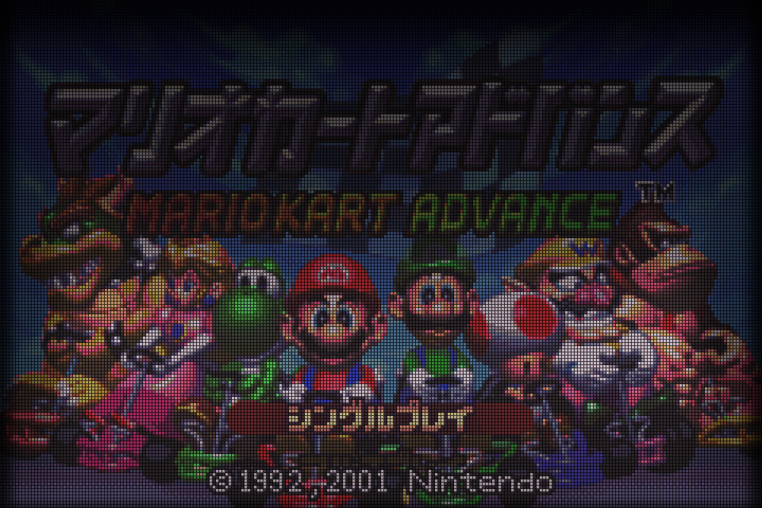
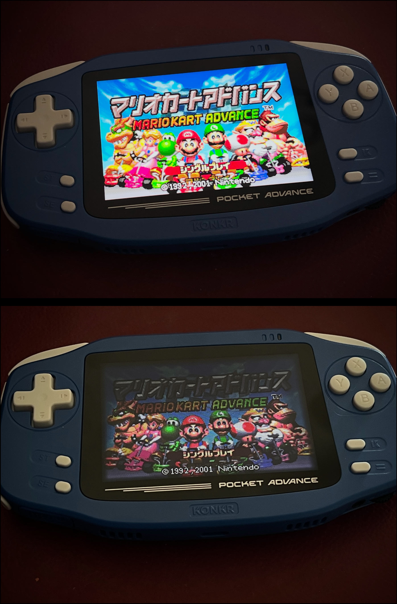
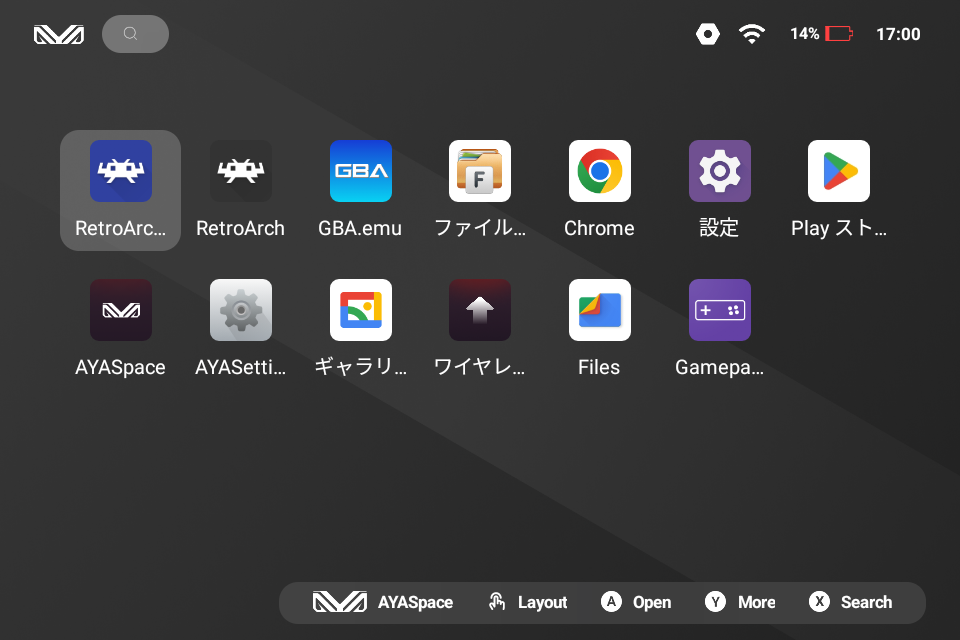

# GBA Native LCD

**English** | [日本語](README_JA.md)

RetroArch GLSL shader project for the GT78-VN Android handheld. The target is a
restrained recreation of the original Game Boy Advance LCD rather than a CRT,
modern IPS, or exaggerated pixel-grid effect.

This is a perceptual recreation, not a colorimeter-generated display profile.
The default values were tuned by repeatedly comparing photographs of an
original reflective GBA LCD with the result on a KONKR Pocket ADVANCE. The
model is split into four independently understandable parts: pixel structure,
color response, bezel shadows and an optional environmental reflection.

## Download

Download the signed KPA APK and `SHA256SUMS` from the
[latest GitHub release](https://github.com/game-de-it/gba-native-lcd/releases/latest).
This package is supported only on KONKR Pocket ADVANCE / GT78-VN.

## Visual comparison

RetroArch captures show the rendered output before it reaches the physical LCD:

| Shader OFF | Shader ON |
| --- | --- |
|  |  |

The photograph below shows the same comparison on the KONKR Pocket ADVANCE.
The upper image is shader OFF; the lower image is shader ON. Unlike the digital
captures, it also includes the target panel's brightness, viewing angle,
surface reflection and camera response.



## Display model

### 1. Pixel structure

The 240 x 160 GBA image maps exactly to the target's 960 x 640 panel. Each GBA
pixel therefore occupies a stable 4 x 4 output-pixel cell. Three columns carry
subtle B, G and R transmission biases; the fourth column and fourth row form
the dark matrix boundary between cells.

| Parameter | Default | Purpose |
| --- | ---: | --- |
| `MATRIX_FACE` | `1.00` | Transmission through the active cell face |
| `MATRIX_GAP` | `0.66` | Reduces the matrix boundary to 34% transmission |
| `SUBPIXEL_STRENGTH` | `0.22` | Keeps BGR separation visible but restrained |
| `SRC_BLEND` | `0.04` | Shares 4% of the source-cell color with direct neighbors |
| `OPTICS_CHROMA` | `0.04` | Small color crosstalk in the cover layer |
| `OPTICS_LUMA` | `0.02` | Smaller luminance crosstalk in the cover layer |

The dark matrix is deliberately more important than rainbow fringing. The
small neighbor blends soften the overly clean edges of a modern IPS panel
without using linear filtering or a general-purpose blur.

### 2. Color response

Color correction is performed before the LCD matrix with a full-strength,
256-step, per-channel LUT. It is intentionally not reducible to a single
brightness, saturation or gamma value. A few representative LUT entries are:

| Input | R | G | B |
| ---: | ---: | ---: | ---: |
| 0 | 20 | 17 | 19 |
| 128 | 29 | 27 | 40 |
| 192 | 39 | 39 | 52 |
| 240 | 62 | 61 | 59 |
| 255 | 80 | 79 | 78 |

`RGB_CURVE_STRENGTH` is `1.00`. The LUT strongly compresses the bright,
saturated output of a modern display into the muted midtones, subdued reds and
greens, and slightly cool dark tones seen in the reference photographs. The
lighting pass then restores luminance as reflected external light rather than
as an emissive backlight.

These values are calibrated for the target device and reference photographs.
Different Android panels, brightness settings and vendor color management may
require a different LUT.

### 3. Bezel shadow and reflected light

The original GBA panel is reflective, has no internal backlight, and sits
behind the front lens rather than being fully laminated to it. The shader
therefore models light falling on a recessed panel instead of adding an
emissive lamp curve.

With sensor lighting enabled, a face-up device starts with a 30-pixel shadow
around all four edges. Tilting the device can extend the raised-edge shadow to
180 pixels while allowing the opposite shadow to disappear. Its root begins at
a `0.25` light multiplier and reaches `0.10` at maximum extension. The lower
panel reflection rises from `1.00` to `1.80`.

Accelerometer input uses no dead zone and a `0.20` low-pass coefficient. This
keeps the shadow responsive while suppressing flicker from button presses and
small hand tremors. The distances and gains are visual tuning values for the
960 x 640 target, not measurements of the original shell in millimeters.

When sensor data is unavailable, the preset falls back to a fixed overhead
light model: rows 0-29 rise from `0.25` to `0.50`, rows 30-179 recover from
`0.50` to neutral light, and rows 180-639 rise from `1.00` to `1.80`.

### 4. Optional environmental reflection

The soft horizontal reflection is not claimed to be a permanent feature of
every original GBA screen. It is a stylized model of a local light source, such
as a window or ceiling light, appearing on a reflective LCD surface. It has no
hard rectangular boundary and moves with device tilt.

| Parameter | Default | Purpose |
| --- | ---: | --- |
| `BAND_LIGHT` | `1.80` | Peak gain of the broad reflection |
| `BAND_WIDTH` | `0.46` | Horizontal half-width of the broad band |
| `BAND_HEIGHT` | `0.168` | Gaussian vertical spread |
| `BAND_TRAVEL` | `0.30` | Maximum normalized movement with tilt |
| `INNER_BAND_LIGHT` | `1.65` | Absolute light level of the softer inner region |
| `INNER_BAND_WIDTH` | `0.16` | Inner core horizontal half-width |
| `INNER_BAND_HEIGHT` | `0.04` | Inner core vertical half-height |
| `INNER_BAND_FADE_WIDTH` | `0.38` | Horizontal fade extent |
| `INNER_BAND_FADE_HEIGHT` | `0.14` | Vertical fade extent |

The inner region converges to an absolute `1.65` instead of multiplying the
outer `1.80` gain. This prevents the center from becoming a clipped white bar
and gives the reflection a less uniform surface. For a stricter panel-only
presentation, set both `BAND_LIGHT` and `INNER_BAND_LIGHT` to `1.00` to disable
the reflection without changing the matrix, LUT or bezel-shadow model.

### Temporal response

Temporal LCD response is applied separately from the four spatial components.
Brightening transitions use a rise speed of `0.81`; falling transitions may
retain a diminishing trail for up to six frames. The effect is intentionally
shorter and weaker than the STN response used by the Game Gear comparison
shader.

## Contents

- `variants/gba-reflective-v2.glslp`: current five-pass release preset
- `variants/rgb-curve-lut.glsl`: 256-step RGB color correction
- `variants/gba-reflective-ghost.glsl`: temporal LCD response
- `variants/gba-reflective-response.glsl`: source-cell optical response
- `variants/gba-reflective-matrix.glsl`: BGR matrix, shadows and reflections
- `variants/gba-reflective-optics.glsl`: final cover-layer crosstalk
- `reference/device-profile.md`: measured target-device configuration
- `reference/tuning-notes.md`: visual intent and parameter guide
- `reference/photos/`: user-provided photographs of an original GBA SP LCD
- `captures/`: before/after device captures used during tuning
- `docs/images/`: README screenshots and physical-device comparison

## Test path on Android

For manual testing, place the files from `variants/` together under:

`/storage/emulated/0/RetroArch/shaders/gba-reflective-v2/`

Load `gba-reflective-v2.glslp` from RetroArch's **Load Preset** command. The
preset, LUT and shaders must remain in the same directory. The Android core
preset loads it automatically for mGBA. Do not save it globally until the
visual comparison and performance test are complete.

The current version does not use linear filtering or an emissive backlight.
Panel softness comes from chroma diffusion with centre luminance preservation.
Illumination is a directional reflected-light field with an upper bezel shadow.

## Release APK integration

The release APK includes the five-pass preset, LUT, mGBA core, menu assets and
the calibrated configuration. It installs the managed shader files in the
application-private directory and applies the mGBA core preset automatically.
Saves, states, screenshots and playlists remain in writable shared storage.

The launcher icon uses a blue background (`RGB 48, 65, 160`) so this build can
be distinguished from the stock RetroArch icon. Depending on the launcher, the
app label may be shortened; the blue icon identifies **RetroArch GBA LCD**.



Sensor-driven lighting requires the bundled RetroArch build because it adds
accelerometer uniforms to the GLSL pipeline. A standard RetroArch build can
still render the preset's fixed-light fallback, but cannot move the bezel
shadows or reflection with device tilt.

### KPA-only release

This APK is released specifically for the **KONKR Pocket ADVANCE / GT78-VN**.
It is not a universal Android display profile. The rendering model assumes the
KPA's 960 x 640 panel, exact 4x presentation of the 240 x 160 GBA image,
measured panel color response, landscape sensor axes and AYANEO system audio.

On a different resolution, the shader still renders, but the 4x4 cell model
and pixel-based shadow distances no longer represent the intended physical
scale. A different panel also needs its own color LUT. Sensor axes may need to
be swapped or inverted. AYANEO Equalizer support only applies to firmware that
provides the compatible Android Dynamics Processing effect.

The package does not contain an artificial product-name lock, so it might
launch on another Arm64 Android device. Such use is unsupported: visual
accuracy, sensor direction, controls, performance and system EQ integration
are not guaranteed. Other handhelds should receive a separately calibrated
device profile and their own physical-device validation.

### AYANEO Equalizer compatibility

The APK is compatible with **AYANEO Equalizer**, the EQ control exposed by the
AYASpace/AYANEO system software on the target device. This is the label shown
by the device UI; [AYANEO's public AYASpace page](https://www.ayaneo.com/ayaspace) describes its system-level
sound effects but does not currently publish a more specific product name for
this Android EQ.

Stock RetroArch's low-latency OpenSL path bypassed the system effect. This build
requests an effect-capable OpenSL performance mode, allowing AYASpace's Android
`Dynamics Processing` effect to attach to the active RetroArch audio session at
48 kHz. The EQ must still be enabled and configured in AYASpace; it is not
implemented or bundled by this APK.

The effect-capable path reports a larger audio buffer than the original fast
path. Testing measured approximately 82 ms instead of 42 ms in AudioFlinger,
although no perceptible audio delay was reported during normal play with the
EQ either enabled or disabled.

### Save data and important notes

The APK uses package ID `com.retroarch.aarch64` and is intended for the
960 x 640 GT78-VN/KONKR Pocket ADVANCE configuration. It installs alongside the
stock `com.retroarch` package and does not reuse the stock app's configuration.

User data is stored outside the app-private managed files:

| Data | Path |
| --- | --- |
| Battery saves | `/storage/emulated/0/RetroArch-gyrotest/saves/` |
| Save states | `/storage/emulated/0/RetroArch-gyrotest/states/` |
| Screenshots | `/storage/emulated/0/RetroArch-gyrotest/screenshots/` |
| Playlists | `/storage/emulated/0/RetroArch-gyrotest/playlists/` |
| BIOS/system files | `/storage/emulated/0/RetroArch-gyrotest/system/` |
| Main configuration | `/storage/emulated/0/Android/data/com.retroarch.aarch64/files/retroarch.cfg` |

In-place APK updates preserve saves, states and normal settings. Bundle version
3 performs one migration to late input polling and disables the VRR-only exact
content-framerate mode; later user changes remain persistent.

Uninstalling the APK should leave the shared `RetroArch-gyrotest` data in
place, but Android may remove the package-specific `Android/data` directory and
therefore `retroarch.cfg`. Back up the configuration before uninstalling or
clearing application storage. Never delete `RetroArch-gyrotest` when it contains
saves or BIOS files that have not been backed up.

Android only accepts an in-place update when the new APK uses the same signing
key. The v0.1.0 release APK is signed with the project's persistent release
certificate documented in [`SIGNING_CERTIFICATE.md`](SIGNING_CERTIFICATE.md).
Every future version must use this same private key. Installing over an older
development-signed test build requires uninstalling it first, which can remove
the package-specific configuration described above.

Release preparation status and remaining publication work are tracked in
[`RELEASE_CHECKLIST.md`](RELEASE_CHECKLIST.md).

## License

Project-authored shader code, tools and documentation are released under the
[MIT License](LICENSE). The bundled APK also contains RetroArch under GPL-3.0+
and the mGBA libretro core under MPL-2.0. Their license texts and third-party
notices are included inside the APK. The MIT license does not replace those
component licenses.

The exact RetroArch modifications used by v0.1.0 are published in the
[game-de-it RetroArch fork](https://github.com/game-de-it/RetroArch/commit/7059a84431cd5c91f417a96250aa8ef088743792).

## Android core-preset fallback

This RetroArch build stores downloaded shaders in app-private storage and may
not enumerate external `.glslp` files in its picker. In that case, install
`core-presets/mGBA/gba.glslp` as:

`/storage/emulated/0/RetroArch/config/mGBA/gba.glslp`

It references the external project preset by absolute path and applies it when
mGBA content starts. The previous core preset is kept in
`backups/gba-online-updater.glslp`.

## macOS preview

`tools/render_preview.py` applies a CPU approximation of the current preset to
the captured no-shader image. It reads the release parameters and RGB LUT, then
creates both a rendered PNG and a three-way comparison with the no-shader
capture and original-panel photograph.

```sh
python3 tools/render_preview.py \
  --preset variants/gba-reflective-v2.glslp \
  --lut variants/rgb_curve_lut.png
```

The default outputs are `captures/preview-current.png` and
`captures/preview-current-comparison.png`. NumPy and Pillow are required.
